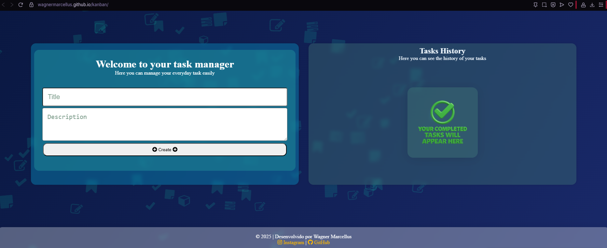
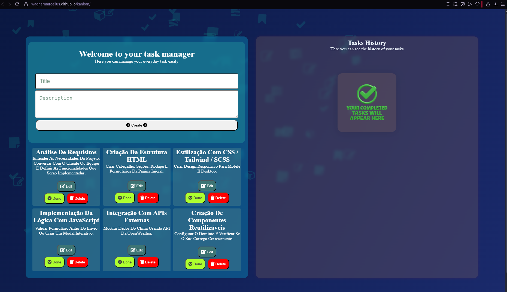
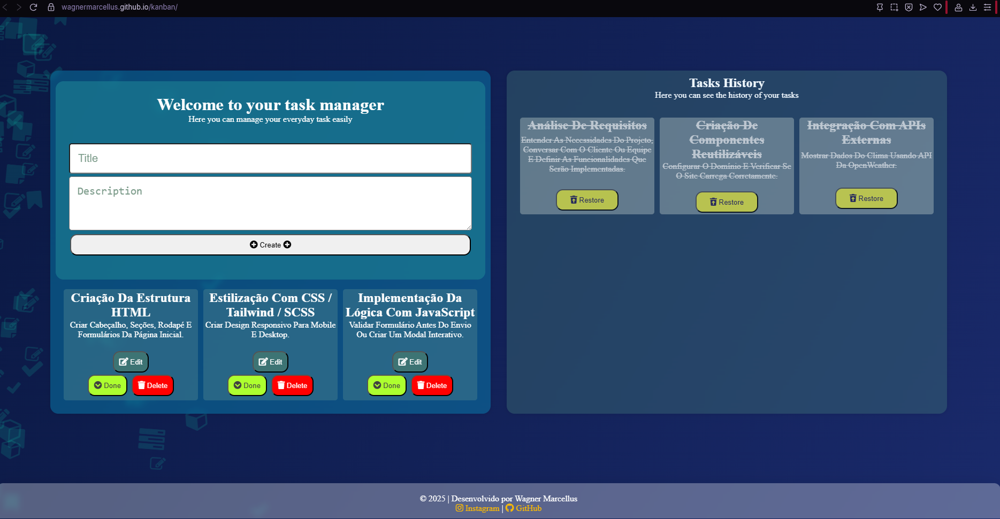
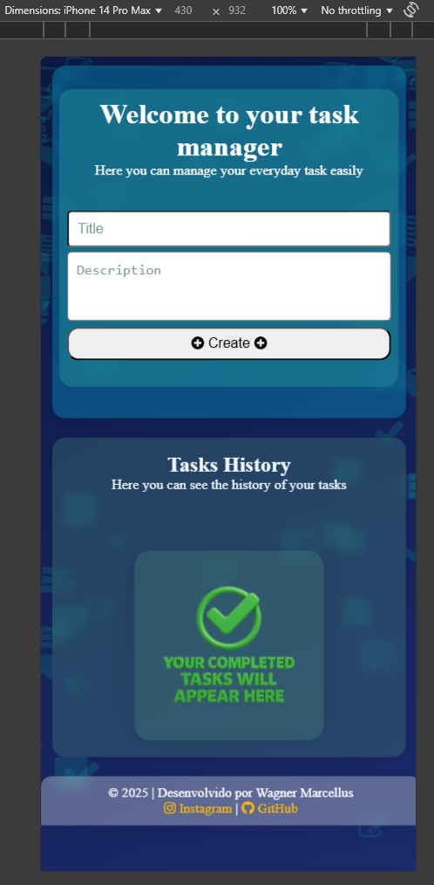
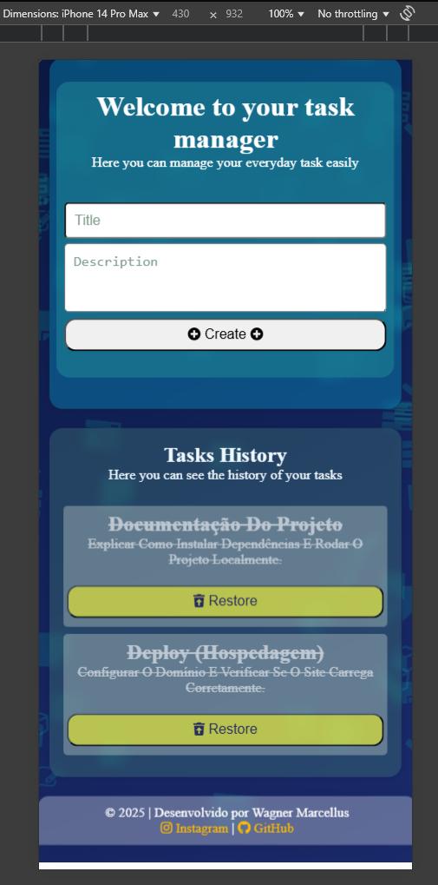

# 📌 Projeto Kanban - SENAI DS 💻🧠

Este é um projeto Kanban criado durante o curso de **Desenvolvimento de Sistemas (DS)** no **SENAI** 🏫🇧🇷.  
📚

O projeto tem como objetivo **praticar e aplicar conceitos de front-end** na criação de uma interface funcional e organizada para o gerenciamento de tarefas. ✅👨‍💻

---

## 🧰 Funcionalidades

- ✅ Criar tarefas  
- 📝 Editar tarefas  
- ❌ Excluir tarefas  
- 📦 Organização das tarefas feitas  
- 💾 Armazenamento local (localStorage) das informações  
- 📱 Responsivo (funciona bem em dispositivos móveis e desktop)

---

## 🛠️ Tecnologias utilizadas

- 🌐 HTML  
- 🎨 CSS  
- ⚙️ JavaScript

---

## 🎯 Objetivo

O foco do projeto é **reforçar os conhecimentos em desenvolvimento web** com uma aplicação prática, visual e útil no dia a dia de quem precisa organizar suas tarefas. 🧩🚀

---

## 📸 Capturas de Tela

### 💻 Versão Desktop

### 📱 Versão Mobile

  
  
  

---
---

## 🚀✨Veja o Projeto Online!✨🚀

👀 Quer conferir como ficou o **Projeto Kanban** funcionando na prática?  
👉 Clique no link abaixo para abrir em uma nova aba e explorar!

🔗 [🗂️ Abrir Projeto Kanban](https://wagnermarcellus.github.io/kanban/) 🔗

---
---
## 📲📸 Estou no IG também

Você pode me encontrar no Instagram:  
[👉 @wagnermarcellus](https://instagram.com/wagnermarcellus)  

---

🛠️ Feito com dedicação e aprendizado durante o curso no SENAI. 💡📘
